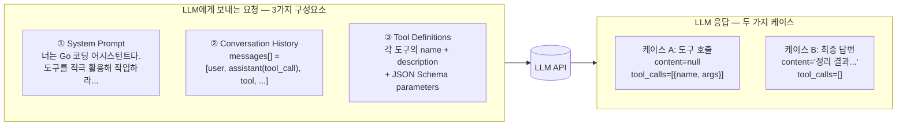

# 2단계: 한 번의 LLM 호출에서 무엇이 오가는가

루프 안의 **④ LLM 호출 + ⑤ 응답 파싱** 한 사이클을 확대.
들어가는 것(요청)과 나오는 것(응답) 두 가지만 명확히 잡으면 된다.

---

## 요청 ↔ 응답 구성도



---

## 실제 프롬프트 / JSON 예시

### ① System prompt (요청마다 같이 보냄)

```text
너는 Go 코드베이스를 돕는 코딩 어시스턴트다.
사용자 요청을 해결하기 위해 필요한 도구를 자유롭게 호출하라.
한 번에 너무 많은 일을 하려 하지 말고, 단계별로 정보를 모은 뒤 답하라.
```

### ③ Tool definition — LLM이 "이 도구를 쓸 수 있구나"라고 이해하도록 스키마를 준다

```json
{
  "type": "function",
  "function": {
    "name": "run_command",
    "description": "셸 명령을 실행하고 stdout을 반환한다",
    "parameters": {
      "type": "object",
      "properties": {
        "command": { "type": "string", "description": "실행할 셸 명령" }
      },
      "required": ["command"]
    }
  }
}
```

### 케이스 A 응답 — 도구를 호출하겠다는 LLM의 답

```json
{
  "role": "assistant",
  "content": null,
  "tool_calls": [{
    "id": "call_abc123",
    "type": "function",
    "function": {
      "name": "run_command",
      "arguments": "{\"command\": \"grep -rn TODO *.go\"}"
    }
  }]
}
```

### ⑨ 도구 결과 메시지 — 에이전트가 실행 후 `messages`에 넣는 것

```json
{
  "role": "tool",
  "tool_call_id": "call_abc123",
  "content": "main.go:10: TODO fix nil check\nutils.go:5: TODO refactor parser"
}
```

---

## 핵심 포인트: `tool_call_id` 매칭

> 어시스턴트가 낸 `tool_calls[].id`와 결과 메시지의 `tool_call_id`가
> **1:1로 맞아야** LLM이 "어떤 호출에 대한 결과인지" 알 수 있다.
> 이 짝이 어긋나면 API 에러 또는 LLM 혼란이 발생한다.
