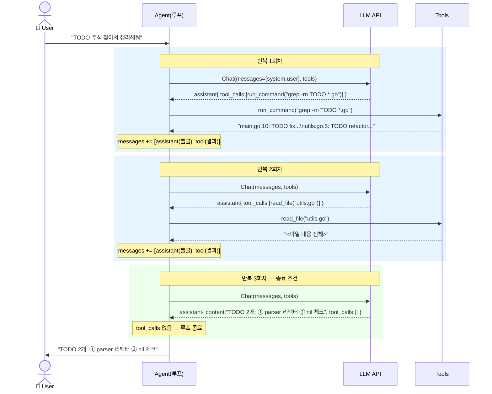

# 3단계: 구체적 예제 — 시퀀스로 보는 실제 흐름

## 요청

> **"이 저장소의 TODO 주석을 찾아서 정리해줘"**

사용 가능한 도구: `run_command`, `read_file`

---

## 시퀀스 다이어그램

---

## 반복별 요약

| 반복 | LLM 응답 | 에이전트 동작 | 다음 |
|---|---|---|---|
| 1회차 | `run_command("grep -rn TODO *.go")` | 명령 실행 → 결과 append | 루프 계속 |
| 2회차 | `read_file("utils.go")` | 파일 읽기 → 결과 append | 루프 계속 |
| 3회차 | `content="TODO 2개: ..."`, `tool_calls=[]` | 최종 답변 판단 | **루프 종료** |

> 매 반복마다 `messages[]`가 누적된다. LLM은 이 히스토리 전체를 보고
> "무엇을 했고, 다음에 뭘 해야 할지"를 판단한다.
