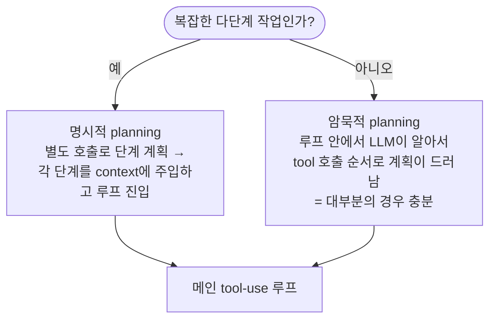

# 5단계: 반드시 챙겨야 할 디자인 디테일

에이전트가 "돌아가는 것"을 넘어 "실전에서 쓸 수 있는 것"이 되려면
아래 항목들을 챙겨야 한다.

---

## 핵심 체크리스트

| 항목 | 설명 | 놓치면 생기는 일 |
|---|---|---|
| **계획 단계** | ① 별도 planning 호출로 구조화 plan을 먼저 뽑거나, ② 루프 안에서 LLM이 알아서 단계화(ReAct). 복잡도에 따라 선택. | 복잡한 작업에서 LLM이 삽질만 반복 |
| **종료 조건** | `tool_calls == []` 일 때 종료. + **최대 반복 횟수 가드 필수**. | 무한 루프, 비용 폭발 |
| **도구 실패 처리** | 에러도 `role=tool` 결과로 넣기 (`"ERROR: ..."`) | LLM이 결과를 못 받아 컨텍스트 꼬임 |
| **`tool_call_id` 짝** | assistant의 call id ↔ tool 결과 id **1:1 매칭** | API 에러 또는 LLM 혼란 |
| **컨텍스트 관리** | messages가 길어지면 과거 tool 결과를 요약/삭제 (컨텍스트 윈도우 초과 방지) | 토큰 초과로 호출 실패 |
| **스트리밍** | 실사용 UX에선 content를 스트리밍 + tool_call은 누적 파싱 | 답변이 다 끝날 때까지 화면 멈춤 |
| **Provider 호환성** | GLM 등 호환 엔드포인트는 Messages API 공통 서브셋만 지원. adaptive thinking · compaction · 서버 도구(web_search/code_execution) · Files/Managed Agents 등은 Anthropic 전용 → [06-provider-config.md](./06-provider-config.md) | GLM에서 beta 기능 의존 시 요청 거부/무시 |

> **구현:** 컨텍스트 관리는 프로젝트 루트의 `agent/compaction.go` (`WithMaxContextTokens`)로
> 구현되어 있다. 입력 토큰 추정치(bytes/4)가 한도를 넘으면 오래된 **(assistant, tool_result) 쌍**
> 단위로 LLM 요약으로 교체한다 — 쌍을 통째로 요약하므로 `tool_use`/`tool_result` 페어링이
> 깨지지 않는다. GLM은 서버 compaction이 없어 이렇게 직접 한다.

---

## planning을 명시적으로 할지 말지

### 두 방식 비교

| | 암묵적 (implicit) | 명시적 (explicit) |
|---|---|---|
| 동작 | 루프 안에서 LLM이 tool 호출 순서로 자연스럽게 계획 | 루프 진입 전 별도 호출로 단계를 먼저 결정 |
| 장점 | 단순, 빠른 시작, 유연 | 복잡한 작업 제어 용이, 진행 상황 가시화 |
| 단점 | 긴 작업에서 삽질 위험 | 지연 증가, 현실이 plan과 어긋나면 깨지기 쉬움 |
| 추천 시점 | **대부분의 경우 (시작은 여기서)** | 작업이 길고 분기가 많을 때 |

> **권장:** 처음엔 암묵적으로 시작하고, 작업이 길고 분기가 많아질 때만
> 명시적 planning 단계를 앞에 붙인다. 처음부터 복잡하게 가면 디버깅이 어렵다.

> **구현:** 명시적 planning은 프로젝트 루트의 `Planner` 인터페이스 + `LLMPlanner`
> (`agent/planner.go`)로 구현되어 있다. `LLMPlanner`는 **도구 없는 단일 호출**로
> 번호 매겨진 계획을 생성하고, 에이전트가 그 계획을 user 턴에 주입한다.
> GLM 호환 엔드포인트에서도 동작 (structured-output beta 불필요).
