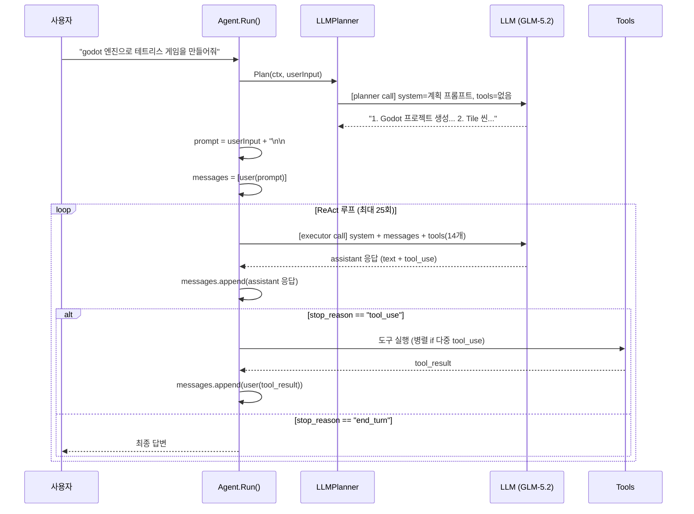

# agentic ReAct 루프 동작 방식 — 실제 실행 트레이스로 이해하기

> 이 문서는 **"godot 엔진으로 테트리스 게임을 만들어줘"** 프롬프트에 대해
> 우리 에이전트가 실제로 어떤 데이터를 주고받으며 동작하는지,
> 녹화된 실제 요청/응답 JSON을 기반으로 단계별로 설명한다.

---

## 목차

1. [ReAct 루프란](#1-react-루프란)
2. [아키텍처 흐름도](#2-아키텍처-흐름도)
3. [핵심 자료 구조](#3-핵심-자료-구조)
4. [실제 실행 환경](#4-실제-실행-환경)
5. [Step 0 — Planning (계획 단계)](#step-0--planning-계획-단계)
6. [Step 1 — 첫 번째 도구 호출 (todo_write)](#step-1--첫-번째-도구-호출-todo_write)
7. [Step 2 — 파일 탐색 (list_files)](#step-2--파일-탐색-list_files)
8. [Step 3 — 파일 작성 (write: project.godot)](#step-3--파일-작성-write-projectgodot)
9. [컨텍스트 성장 패턴](#9-컨텍스트-성장-패턴)
10. [tool_call_id 매칭 메커니즘](#10-tool_call_id-매칭-메커니즘)
11. [전체 트레이스 요약](#11-전체-트레이스-요약)
12. [스트리밍 처리 (Accumulate)](#12-스트리밍-처리-accumulate)
13. [에러 처리](#13-에러-처리)

---

## 1. ReAct 루프란

**ReAct(Reasoning + Acting)** 패턴은 LLM이 "생각하고 → 도구를 호출하고 → 결과를 보고 → 다시 생각하는" 순환 구조다.

```
사용자 요청
    ↓
┌───────────────────────────────────┐
│  ① LLM 호출 (현재 컨텍스트 + 도구) │
│  ② 응답 분석                       │
│     - tool_use 있음 → ③ 으로       │
│     - tool_use 없음 → 최종 답변    │
│  ③ 도구 실행 → 결과를 컨텍스트에 추가 │
│  → ① 으로 돌아감 (루프)             │
└───────────────────────────────────┘
    ↓
최종 답변
```

우리 에이전트는 이 루프에 **명시적 planning 단계**를 추가한다:
루프 진입 전에 한 번의 (도구 없는) LLM 호출로 단계별 계획을 생성하고,
이를 사용자 메시지에 주입한 뒤 루프에 들어간다.

---

## 2. 아키텍처 흐름도



---

## 3. 핵심 자료 구조

### 3.1 Go 구조체 → JSON wire format

에이전트 내부에서 사용하는 핵심 타입과 API로 전송되는 JSON 형태:

```go
// agent/agent.go — 에이전트가 LLM에 보내는 요청
type MessageNewParams struct {
    Model     string             // "glm-5.2"
    MaxTokens int64              // 1024
    System    []TextBlockParam   // 시스템 프롬프트
    Messages  []MessageParam     // 대화 이력
    Tools     []ToolUnionParam   // 도구 정의
}
```

### 3.2 Message (메시지)

Anthropic Messages API의 메시지는 역할(role) + content blocks 로 구성:

```jsonc
// user 메시지 (텍스트)
{
  "role": "user",
  "content": [{"type": "text", "text": "godot 엔진으로 테트리스..."}]
}

// assistant 메시지 (텍스트 + 도구 호출)
{
  "role": "assistant",
  "content": [
    {"type": "text", "text": "Godot 4.x 테트리스 게임을..."},
    {"type": "tool_use", "id": "call_e7f9...", "name": "todo_write",
     "input": {"todos": [{"subject": "...", "status": "..."}]}}
  ]
}

// user 메시지 (도구 결과)
{
  "role": "user",
  "content": [
    {"type": "tool_result", "tool_use_id": "call_e7f9...",
     "content": [{"type": "text", "text": "8 todos stored"}]}
  ]
}
```

> **핵심**: `tool_use.id` ↔ `tool_result.tool_use_id` 가 **1:1로 매칭**되어야 한다.
> 이 짝이 어긋나면 API 에러가 발생한다.

### 3.3 Tool Definition (도구 정의)

LLM에게 "이런 도구를 쓸 수 있다"라고 알려주는 JSON Schema:

```jsonc
{
  "name": "write",
  "description": "base 디렉토리 내에 파일을 생성하거나 덮어쓴다. 디렉토리는 자동 생성된다.",
  "input_schema": {
    "type": "object",
    "properties": {
      "path":     {"type": "string", "description": "base 기준 상대 경로"},
      "content":  {"type": "string", "description": "파일에 쓸 전체 내용"}
    }
  }
}
```

에이전트는 14개 도구를 매 요청마다 `tools` 배열에 포함하여 보낸다:
```
read_file, write, edit, multi_edit, notebook_edit,
run_command, bash_output, kill_shell,
glob, grep, list_files,
web_fetch, todo_write, task
```

---

## 4. 실제 실행 환경

이 문서의 데이터는 다음 명령으로 실제 실행한 결과다:

```bash
AGENT_RECORD_DIR=agent/testdata/godot_tetris \
  go run . 'godot 엔진으로 테트리스 게임을 만들어줘. 메인 씬과 스크립트를 작성해.'
```

- **모델**: `glm-5.2` (GLM Coding Plan, `https://open.bigmodel.cn/api/anthropic`)
- **max_tokens**: 1024 (one-shot 모드)
- **도구**: 14개 (CCTools + task)
- **planner**: 활성화
- **compaction**: 한도 50000 토큰 (이 실행에서는 미발동)
- **녹화**: 7회 호출 (000~006), 각 호출의 request/response JSON 저장

---

## Step 0 — Planning (계획 단계)

루프 진입 전, **도구 없이** 한 번의 LLM 호출로 실행 계획을 생성한다.

### Request (000_request.json)

```jsonc
{
  "model": "glm-5.2",
  "max_tokens": 1024,
  "system": [{
    "type": "text",
    "text": "사용자의 요청을 해결하기 위한 실행 계획을 작성하라.\n규칙:\n- 도구를 호출하지 말고 텍스트로만 답한다.\n- 번호가 매겨진 간결한 단계 목록만 출력한다.\n- 각 단계는 구체적이고 실행 가능해야 한다 (무엇을 할지).\n- 코드나 셸 명령은 적지 않는다."
  }],
  "messages": [{
    "role": "user",
    "content": [{"type": "text", "text": "godot 엔진으로 테트리스 게임을 만들어줘. 메인 씬과 스크립트를 작성해."}]
  }]
  // 주의: "tools" 필드 없음 → 모델은 도구를 호출할 수 없다
}
```

### Response (000_response.json)

```jsonc
{
  "id": "msg_...",
  "type": "message",
  "role": "assistant",
  "model": "glm-5.2",
  "stop_reason": "end_turn",     // 도구 없음 → 바로 종료
  "content": [{
    "type": "text",
    "text": "1. Godot 프로젝트를 생성하고 메인 씬(Main)을 2D 노드로 생성한다.\n2. 블록 1칸의 기본 단위가 될 'Tile' 씬을 ColorRect 노드 또는 Sprite2D 노드로 만든다.\n3. 7가지 테트로미노스(I, O, T, S, Z, J, L) 모양을 2차원 배열 데이터로 정의한다.\n4. 메인 씬의 자식으로 게임 판의 크기(예: 10x20)를 관리할 TileMap 노드를 추가한다.\n5. 메인 씬에 게임 로직을 담당할 새 스크립트(예: `Main.gd`)를 작성하고 연결한다.\n6. 스크립트 내에 블록의 좌우 이동, 아래로 이동(소프트 드롭), 회전 로직을 구현한다.\n7. 키 입력이 없을 때 블록이 일정 시간마다 자동으로 낙하하도록 Timer 노드를 추가...\n...(총 12단계)"
  }],
  "usage": {"input_tokens": 98, "output_tokens": 312}
}
```

### 계획 주입

에이전트는 계획을 원래 사용자 메시지 뒤에 `## 실행 계획` 섹션으로 append:

```go
// agent.go Run() 내부
prompt = userInput + "\n\n## 실행 계획\n" + plan
a.messages = append(a.messages, anthropic.NewUserMessage(anthropic.NewTextBlock(prompt)))
```

결과적으로 executor에게 전달되는 첫 user 메시지:

```text
godot 엔진으로 테트리스 게임을 만들어줘. 메인 씬과 스크립트를 작성해.

## 실행 계획
1. Godot 프로젝트를 생성하고 메인 씬(Main)을 2D 노드로 생성한다.
2. 블록 1칸의 기본 단위가 될 'Tile' 씬을 ColorRect 노드 또는 Sprite2D 노드로 만든다.
3. 7가지 테트로미노스(I, O, T, S, Z, J, L) 모양을 2차원 배열 데이터로 정의한다.
...
```

---

## Step 1 — 첫 번째 도구 호출 (todo_write)

### Request (001_request.json)

```jsonc
{
  "model": "glm-5.2",
  "max_tokens": 1024,
  "system": [{"type": "text", "text": "너는 Go 코드베이스를 돕는 코딩 어시스턴트다. 필요한 도구를 호출해 단계적으로 작업하고, 마지막에 결과를 간결히 요약해 답한다."}],
  "messages": [
    {
      "role": "user",
      "content": [{"type": "text", "text": "godot 엔진으로 테트리스... ## 실행 계획 1. Godot 프로젝트..."}]
    }
  ],
  "tools": [
    {"name": "read_file", "description": "...", "input_schema": {"type": "object", "properties": {"path": {"type": "string", "description": "..."}}}},
    {"name": "write", "description": "base 디렉토리 내에 파일을 생성하거나 덮어쓴다...", "input_schema": {"type": "object", "properties": {"path": {"type": "string"}, "content": {"type": "string"}}}},
    {"name": "edit", ...},
    {"name": "multi_edit", ...},
    {"name": "notebook_edit", ...},
    {"name": "run_command", ...},
    {"name": "bash_output", ...},
    {"name": "kill_shell", ...},
    {"name": "glob", ...},
    {"name": "grep", ...},
    {"name": "list_files", ...},
    {"name": "web_fetch", ...},
    {"name": "todo_write", ...},
    {"name": "task", ...}
    // 총 14개
  ]
}
```

> **messages**: 1개 (user 1개). planner 호출과 달리 **14개 도구**가 포함된다.

### Response (001_response.json)

```jsonc
{
  "id": "msg_202608010017468a6f0097ec074444",
  "type": "message",
  "role": "assistant",
  "model": "glm-5.2",
  "stop_reason": "tool_use",       // ← 도구 호출 요청!
  "content": [
    {
      "type": "text",
      "text": "Godot 4.x 테트리스 게임을 만들어 드리겠습니다. 단계별로 진행하겠습니다."
    },
    {
      "type": "tool_use",
      "id": "call_e7f94e158dcd4173b7f2441f",   // ← tool_call_id
      "name": "todo_write",
      "input": {
        "todos": [
          {"status": "in_progress", "subject": "Godot 프로젝트 파일 구조 및 project.godot 생성"},
          {"status": "pending", "subject": "Tile 씬 작성"},
          {"status": "pending", "subject": "NextBlock 프리뷰 씬"},
          {"status": "pending", "subject": "Main.tscn 씬 작성"},
          {"status": "pending", "subject": "Main.gd 스크립트 작성"},
          {"status": "pending", "subject": "Tetromino.gd 데이터 스크립트"},
          {"status": "pending", "subject": "게임 로직 구현 및 테스트"},
          {"status": "pending", "subject": "최종 테스트 및 문서"}
        ]
      }
    }
  ],
  "usage": {"input_tokens": 2289, "output_tokens": 254}
}
```

### 에이전트 처리

```go
// 1. assistant 응답을 히스토리에 append
a.messages = append(a.messages, resp.ToParam())

// 2. stop_reason == "tool_use" → 루프 계속

// 3. tool_use 블록 실행
// runOneTool → invokeTool → tools["todo_write"].Run(args)
// todo_write Run: *store = in.Todos → "8 todos stored"

// 4. tool_result를 user 메시지로 append
a.messages = append(a.messages, anthropic.NewUserMessage(
    anthropic.NewToolResultBlock("call_e7f94e158dcd4173b7f2441f", "8 todos stored", false),
))
```

---

## Step 2 — 파일 탐색 (list_files)

### Request (002_request.json) — messages: 3개

```
messages[0]  user:      text("godot 엔진으로... ## 실행 계획...")
messages[1]  assistant: text("Godot 4.x 테트리스...") + tool_use(todo_write, id=call_e7f9...)
messages[2]  user:      tool_result(tool_use_id=call_e7f9..., content="8 todos stored")
```

> **컨텍스트 성장**: 매 턴마다 assistant 1개 + tool_result 1개 = **2개씩 증가**.

### Response (002_response.json)

```jsonc
{
  "stop_reason": "tool_use",
  "content": [
    {"type": "text", "text": "먼저 프로젝트 파일 구조를 살펴보고 필요한 파일들을 만들겠습니다."},
    {
      "type": "tool_use",
      "id": "call_...",
      "name": "list_files",
      "input": {"path": "."}
    }
  ]
}
```

### tool_result (list_files 실행 결과)

```text
dir	.git
dir	.github
dir	agent
dir	config
dir	docs
dir	examples
dir	mcp
dir	tui
file	.env
file	.env.example
file	.gitignore
file	.goreleaser.yaml
file	Makefile
file	README.ko.md
file	README.md
file	go.mod
file	go.sum
file	hello.txt
file	main.go
```

이 결과가 다음 요청의 `messages[4]`(user, tool_result)로 들어간다.

---

## Step 3 — 파일 작성 (write: project.godot)

### Request (003_request.json) — messages: 5개

```
messages[0]  user:       text("godot... ## 실행 계획...")
messages[1]  assistant:  text + tool_use(todo_write)
messages[2]  user:       tool_result("8 todos stored")
messages[3]  assistant:  text + tool_use(list_files, path=".")
messages[4]  user:       tool_result("dir\t.git\nfile\tmain.go\n...")
```

### Response (003_response.json)

```jsonc
{
  "stop_reason": "tool_use",
  "content": [
    {"type": "text", "text": "## 1단계: 프로젝트 파일 (project.godot) 생성"},
    {
      "type": "tool_use",
      "id": "call_...",
      "name": "write",
      "input": {
        "path": "godot-tetris/project.godot",
        "content": "; Engine configuration file.\n; Godot 4.x\nconfig_version=5\n\n[application]\nconfig/name=\"Tetris\"\n..."
      }
    }
  ]
}
```

### ChangeHook 발동

`write` 도구는 파일 변경 후 `ChangeHook`을 호출한다:

```go
// agent/cctools.go NewWriteTool Run 내부
old, _ := os.ReadFile(full)     // 기존 내용 (신규 파일이면 "")
os.WriteFile(full, content)
if hook != nil {
    hook(in.Path, string(old), in.Content)  // → TUI diff 렌더링
}
```

---

## 9. 컨텍스트 성장 패턴

각 LLM 호출 시 messages 배열이 어떻게 성장하는지:

| 호출 | 역할 | messages 수 | 추가된 내용 |
|------|------|------------|------------|
| 000 | planner | 1 | user(input) |
| 001 | executor #0 | 1 | (동일 user + plan 주입) |
| 002 | executor #1 | 3 | +assistant(todo_write) +user(tool_result) |
| 003 | executor #2 | 5 | +assistant(list_files) +user(tool_result) |
| 004 | executor #3 | 7 | +assistant(write project.godot) +user(tool_result) |
| 005 | executor #4 | 9 | +assistant(write Tile.tscn) +user(tool_result) |
| 006 | executor #5 | 11 | +assistant(write NextBlock.tscn) +user(tool_result) |

```
메시지 수 = 1 + 2 × (실행 반복 횟수)
```

> **compaction**: `maxContextTokens`을 넘으면 오래된 라운드(assistant 메시지 + 그에 답하는
> `tool_result` 전부)를 LLM 요약으로 교체한다. 라운드 경계에서만 자르므로 병렬 tool call 이
> 있어도 페어링이 깨지지 않는다. 이 실행에서는 50000 토큰 한도에 도달하지 않아 미발동.

---

## 10. tool_call_id 매칭 메커니즘

가장 중요한 규칙 중 하나: **assistant가 낸 tool_use.id와 tool_result의 tool_use_id가 1:1로 매칭**되어야 한다.

```
assistant content:
  tool_use { id: "call_e7f94e158dcd4173b7f2441f", name: "todo_write", input: {...} }

→ 에이전트 실행 → "8 todos stored"

user content (다음 메시지):
  tool_result { tool_use_id: "call_e7f94e158dcd4173b7f2441f", content: "8 todos stored" }
                ^^^^^^^^^^^^^^^^^^^^^^^^^^^^^^^^^^^^^^^^^^^^
                반드시 동일한 ID
```

```go
// agent/agent.go runOneTool
func (a *Agent) runOneTool(ctx, tu anthropic.ToolUseBlock) ContentBlockParamUnion {
    // tu.ID = "call_e7f94e..."
    out, err := a.invokeTool(ctx, tu.Name, args)
    // 결과를 tu.ID와 매칭하여 tool_result 생성
    return anthropic.NewToolResultBlock(tu.ID, out, err != nil)
    //                     ^^^^^^^^^
}
```

**병렬 도구 호출 시**: 한 assistant 응답에 여러 tool_use가 있으면 각각 별도 goroutine으로
실행하고, 모든 tool_result를 **하나의 user 메시지**에 묶어 반환한다.

---

## 11. 전체 트레이스 요약

```
[사용자] "godot 엔진으로 테트리스 게임을 만들어줘. 메인 씬과 스크립트를 작성해."
    │
    ▼
[planner] glm-5.2, tools=0, messages=1
    │ 응답: 12단계 실행 계획
    ▼
[executor #0] glm-5.2, tools=14, messages=1
    │ 응답: tool_use(todo_write) — 8개 작업 목록 저장
    ▼
[executor #1] tools=14, messages=3
    │ 응답: tool_use(list_files, ".") — 현재 디렉토리 확인
    ▼
[executor #2] tools=14, messages=5
    │ 응답: tool_use(write, "godot-tetris/project.godot") — 프로젝트 파일 생성
    ▼
[executor #3] tools=14, messages=7
    │ 응답: tool_use(write, "godot-tetris/Tile.tscn") — Tile 씬 생성
    ▼
[executor #4] tools=14, messages=9
    │ 응답: tool_use(write, "godot-tetris/NextBlockPreview.tscn") — NextBlock 씬
    ▼
[executor #5] tools=14, messages=11
    │ 응답: tool_use(todo_write) — 진행 상황 업데이트
    ▼
[executor #6] tools=14, messages=13
    │ 응답: tool_use(write, "godot-tetris/Main.tscn") — 메인 씬 작성 시도
    │       → 스트리밍 accumulation 에러 (GLM 응답 JSON 말단 누락)
    ✗ 에러: "accumulate stream event: error converting content block to JSON"
```

> **총 7회 LLM 호출** (planner 1 + executor 6). 에러 전까지 5개 파일 생성 + 2회 todo 업데이트.

---

## 12. 스트리밍 처리 (Accumulate)

LLM 호출은 스트리밍으로 이루어진다 (`Messages.NewStreaming`):

```go
// agent/client.go StreamMessage
stream := a.c.Messages.NewStreaming(ctx, params)
msg := anthropic.Message{}
for stream.Next() {
    ev := stream.Current()
    msg.Accumulate(ev)              // 이벤트를 Message로 조립
    if onDelta != nil {
        // text delta 추출 → 실시간 콜백
        switch e := ev.AsAny().(type) {
        case anthropic.ContentBlockDeltaEvent:
            if d, ok := e.Delta.AsAny().(anthropic.TextDelta); ok {
                onDelta(d.Text)     // TUI에서 토큰 단위 렌더
            }
        }
    }
}
return &msg, stream.Err()   // 조립된 전체 Message 반환
```

스트리밍 이벤트 시퀀스 (GLM → 에이전트):

```
message_start → content_block_start(text) → content_block_delta("Godot") →
content_block_delta(" 4.x") → ... → content_block_stop →
content_block_start(tool_use) → input_json_delta("{\"todos\":") → ... →
content_block_stop → message_delta(stop_reason="tool_use") → message_stop
```

에이전트는 이 스트림을 `Accumulate`로 전체 Message로 조립하면서,
동시에 텍스트 델타만 `onDelta` 콜백으로 TUI에 실시간 전달한다.

---

## 13. 에러 처리

### 도구 실행 실패

도구 실행 중 에러가 발생해도 tool_result로 모델에 돌려보내어 복구 기회를 준다:

```go
out, err := tool.Run(ctx, args)
if err != nil {
    // 에러도 tool_result로 전송 (is_error=true)
    return anthropic.NewToolResultBlock(tu.ID, "ERROR: "+err.Error(), true)
}
```

### 스트리밍 에러 (이 실행에서 발생)

7번째 호출(executor #6)에서 GLM이 불완전한 JSON을 스트리밍하여 Accumulate 에러 발생:

```
llm call (iter 6): accumulate stream event: error converting content block to JSON:
  json: error calling MarshalJSON for type json.RawMessage: unexpected end of JSON input
```

→ `agent.Run`이 에러 반환 → `log.Fatal`로 종료. 이미 생성된 5개 파일은 디스크에 남아 있다.

### 루프 안전장치

```go
for iter := 0; iter < a.maxIters; iter++ {  // 기본 25회
    // ...
}
return "", errors.New("agent: max iterations reached")
```

---

## 부록: 녹화된 데이터 파일

실제 실행 데이터는 `agent/testdata/godot_tetris/`에 저장되어 있다:

```
agent/testdata/godot_tetris/
  000_request.json   planner 요청 (system=계획 프롬프트, tools=없음)
  000_response.json  planner 응답 (12단계 계획)
  001_request.json   executor #0 요청 (system=메인, tools=14, messages=1)
  001_response.json  executor #0 응답 (todo_write 호출)
  002_request.json   executor #1 요청 (messages=3)
  002_response.json  list_files 호출
  003_request.json   executor #2 요청 (messages=5)
  003_response.json  write(project.godot) 호출
  004_request.json~006_response.json  이후 호출들
  007_request.json   executor #6 요청 (응답 에러로 response 없음)
```

> 이 파일들에는 API 키가 포함되어 있지 않다 (키는 HTTP 헤더로만 전송).
> 재생 테스트: `go test ./agent/ -run TestRun_replayRealGLM -v`
> (단, 이 시나리오는 별도 replay 테스트가 필요하다 — 기존 테스트는 glm_hello/glm_write 한정)
